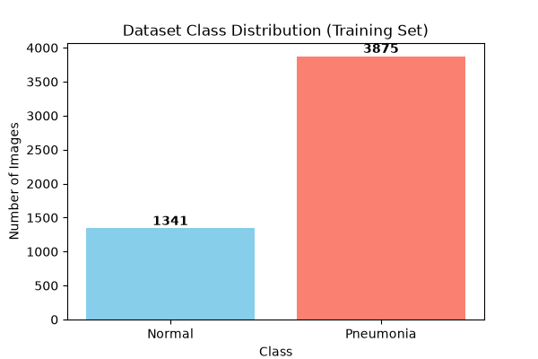
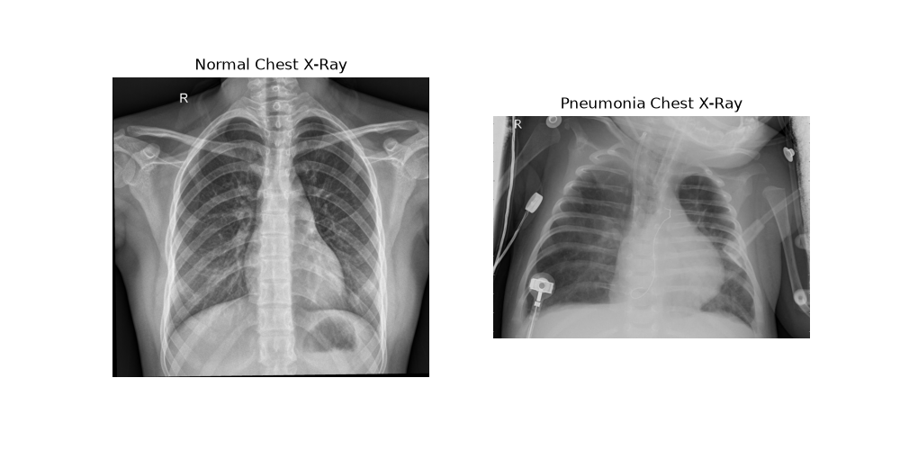
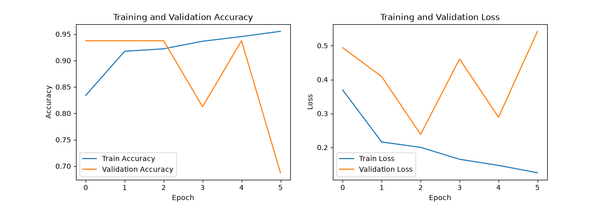
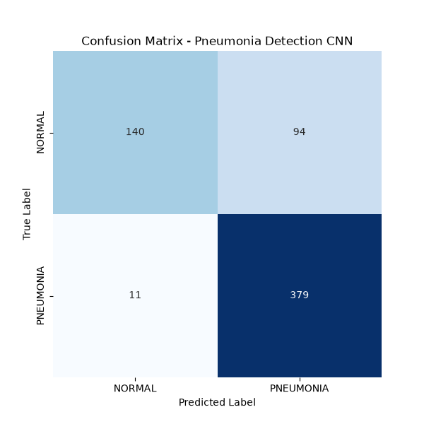

# Pneumonia Detection Using Convolutional Neural Networks (CNN)

An end-to-end deep learning project built to classify chest X-ray images as either **Normal** or **Pneumonia** using TensorFlow/Keras and Jupyter Notebooks.

## Project Structure

PNEUMONIA-DETECTION/
│
├── data/                      # Dataset folder (Kaggle Chest X-Ray Images)
│   └── chest_xray/
│       ├── train/
│       ├── val/
│       └── test/
│
├── notebooks/                 # Jupyter Notebooks pipeline
│   ├── 01_eda.ipynb           # Exploratory Data Analysis & visualization
│   ├── 02_preprocessing.ipynb # Data pipeline verification & tensor shapes
│   ├── 03_model_training.ipynb# Custom CNN architecture & training
│   └── 04_evaluation.ipynb    # Metrics, classification report, & testing
│
├── models/                    # Saved model weights
│   └── pneumonia_cnn_model.keras
│
├── outputs/                   # Saved evaluation plots (Confusion Matrix)
│   └── confusion_matrix.png
│
├── requirements.txt           # Python dependencies
└── README.md                  # Project documentation


## How to Run
1. Install the required dependencies:
   ```bash
   pip install -r requirements.txt

Open Jupyter Notebook from your project root:
     bash  
          jupyter notebook 
Run the notebooks in sequential order (01 through 04) to explore data, train the model, and evaluate performance.


# Pneumonia Detection Using Convolutional Neural Networks (CNN)

## Dataset Distribution


## Sample X-Ray Comparison


## Model Training Progress


## Evaluation Results (Confusion Matrix)
